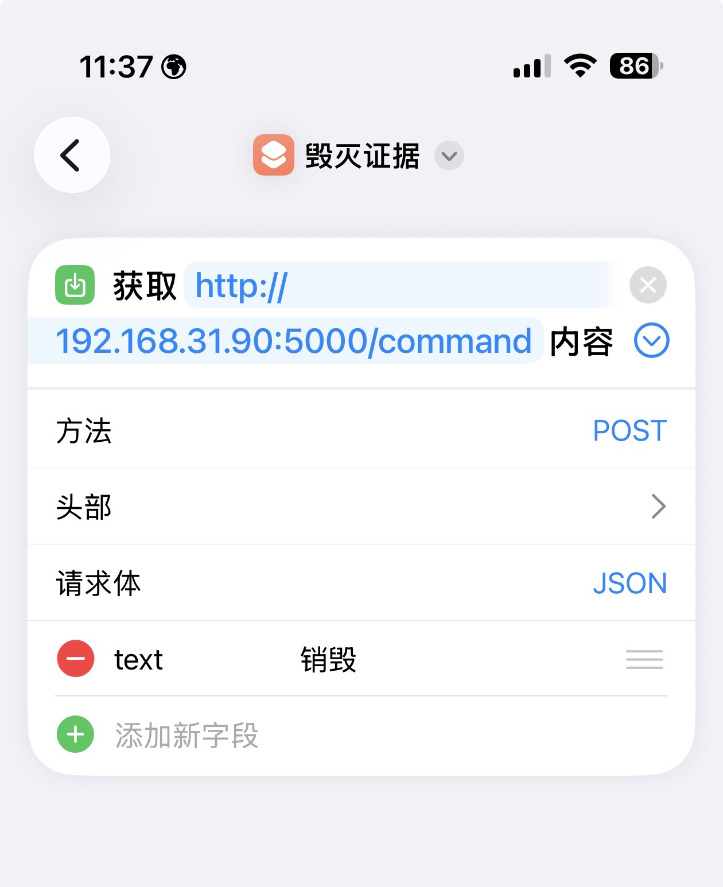

# 🛡️ 贾维斯 (JARVIS) - 网络 API 指挥官

[](https://www.microsoft.com/windows)
[](#)

> **核心定义**: 这是一个以 **API 驱动** 为灵魂的 Windows 远程控制器。它不仅是一个网页，更是你电脑的“云端外壳”。

---

## 📱 玩法：iOS 快捷指令 + Siri 联动

本系统的核心价值在于 **“零接触操纵”**。你可以通过 iOS 的“快捷指令” App，通过 `获取 URL 内容 (POST)` 的方式，实现 **“嘿 Siri，销毁证据”** 或 **“嘿 Siri，静音模式”**。

### 如何配置 Siri 控制？
1. **新建快捷指令**: 打开 iOS “快捷指令” -> 创建新指令。
2. **添加操作**: 搜索“获取 URL 内容”。
3. **设置参数**:
   - **URL**: `http://[你的局域网IP]:20026/command`
   - **方法**: `POST`
   - **请求正文 (JSON)**: `{"text": "你的指令参数"}` (例如：`{"text": "锁屏"}`)
4. **命名指令**: 比如叫“锁定电脑”。
5. **语音控制**: 对着 iPhone 喊：**“嘿 Siri，锁定电脑”**，你的 PC 就会瞬间响应并回复真人语音。




---

## 🎨 系统仪表盘 (网页版)

> **注**: 网页仪表盘（`http://localhost:5000`）主要用于 **功能测试**、**查看指令文本** 以及 **动态配置重载**。

### 控制面板特性:
- **可视化测试**: 一键点击，实测 `config.py` 中的动作是否生效。
- **动态状态**: 实时切换 **“极速本地/云端真人”** 语音引擎。
- **🔄 热重载**: 修改 `config.py` 后点击顶部的“重载配置”，无需物理重启程序。

---

## ✨ 核心特性

- **🚀 异步多线程**: 指令执行与语音播报完全解耦，按钮响应快如闪电。
- **🎙️ 二代真人语音**: 基于微软 Edge-TTS (Yunxi/Xiaoxiao)，提供电影级的原声回馈。
- **⚙️ 全开放架构**: 只要懂一点 Python，就能在 `actions.py` 里添加任何系统级操作。

---

## 🛠️ 快速部署

1. **环境准备**: Python 3.10+
2. **安装核心库**:
```powershell
pip install -r requirements.txt
```
3. **点火启动**:
```powershell
python assistant_main.py
```

---

## ⚙️ 进阶配置

### 1. 系统托盘与后台管理
程序启动后，右下角任务栏会出现 **蓝色圆圈图标**：
*   **右键菜单**: 可快速打开仪表盘、重载配置或退出程序。
*   **静默运行**: 即使没有命令行窗口，你依然可以通过托盘图标完全掌控 JARVIS。

### 2. 设置开机自启 (极致隐藏模式)
如果你希望每次 Windows 启动时 JARVIS 自动在后台运行（且不弹黑窗口）：
1. 确保已经通过 `pip install -r requirements.txt` 安装了所有依赖。
2. 在项目根目录运行：
   ```powershell
   python setup_autostart.py
   ```
3. **取消自启**: 按下 `Win + R` 键，输入 `shell:startup`，删掉里面的 `JARVIS_AutoStart.vbs` 即可。

## 🛠️ 开发者指南：如何添加新功能？

得益于 **模块化架构**，你可以非常轻松地为 JARVIS 增加新的超能力。

### 案例：添加一个“开启守望先锋”按钮

如果你想通过网页或 Siri 开启游戏，命令为：`"D:\baoxuegame\Overwatch\Overwatch Launcher.exe" --productcode=pro`

#### 第一步：在 `config.py` 中注册指令
打开 `config.py`，在 `COMMANDS` 字典中添加一项：

```python
    "open_ow": {
        "label": "🎮 开启守望",
        "post_params": ["开启守望", "OW"],
        "action": "run_cmd",  # 使用通用命令执行工具
        "params": [r'"D:\baoxuegame\Overwatch\Overwatch Launcher.exe" --productcode=pro'],
        "reply": "正在为您开启守望先锋，祝您游戏愉快",
    },
```

#### 第二步：(进阶) 编写自定义逻辑
如果你需要更复杂的逻辑（比如不仅要开游戏，还要自动调整音量），你可以：
1.  在 `actions/` 文件夹下新建一个 `my_game_mode.py`。
2.  编写代码：
    ```python
    import os
    vm = None
    def set_vm(v): global vm; vm = v

    def run():
        # 1. 调大音量
        if vm: vm.set_volume(80) 
        # 2. 启动游戏
        os.system(r'start "" "D:\baoxuegame\Overwatch\Overwatch Launcher.exe" --productcode=pro')
        return True
    ```
3.  在 `config.py` 中将 `action` 改为 `my_game_mode` 即可！

#### 第三步：应用生效
修改完成后，只需在 **网页仪表盘** 点击顶部的 **🔄 重载配置**，新功能立即上线，无需重启程序！

---

*Jarvis v7.6 - Designed for absolute control.*
